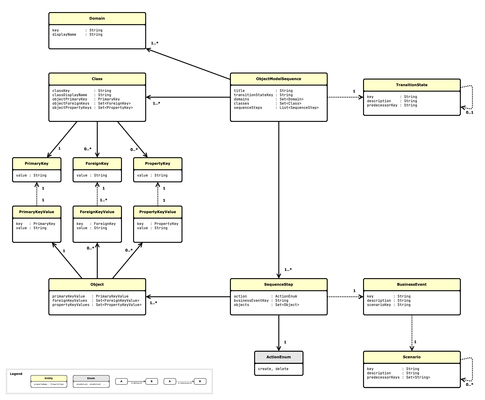

# objectmodeldiagramgenerator

Generates sequences of object model diagams in the form of PlantUML files.

You can define the object model in on Excel file following a specific proprietary structure.
The underlying domain model allows you to define:
- There are scenarios. Each scenario has a key and can relate to other scenarios.
- There are business events. Each business event has a key and must relate to one scenario.
- There are domains. Each domain has a key.
- There are classes. Each class has a name and must relate to one domain.
- There are objects. Each object has a key and must relate to one business event and one class. Each object can relate to other objects. Each object can have properties (that is, a tupel of a name and and value).
- To bring everything together there are object model sequences and their contained steps. Each step defines which objects are to be created or deleted, and to which business event this it belongs to.

Following domain model diagram shows how the various entities are connected, and what you can describe in the Excel file to later get the object diagrams generated out of.



Based on this information defined following this domain model the generator creates a list of text files.
Each text file contains the definition of one diagram using the PlantUML DSL.

Once these text files are created, you can use PlantUML CLI to convert the text files in - for example - PNG files. 

## Quick start
To start the diagram generation you need to have a Java runtime environment installed with at least version 8.
Then try the following on the command line in the main folder:

```
java -jar releases/objectmodeldiagramgenerator-3.0.1.jar -i src/test/resources/testobjectmodeldefinition.xlsx -o myfirsttest
```

If the generator run was successful, you will find a bunch of puml files in the folder "myfirsttest".

If you now want to also generate PNG files to directly look at the diagrams in a normal image viewer, then try the following two commands (assuming that you have the PlantUML jar file stored in ~/tools/plantuml.jar):

```
java -DPLANTUML_LIMIT_SIZE=15000 -jar ~/tools/plantuml.jar myfirsttest/*.puml png -o ./png
java -DPLANTUML_LIMIT_SIZE=15000 -jar ~/tools/plantuml.jar myfirsttest/PersonsAndHouses/*.puml png -o png
```

After the two commands have run without problems you will find the generated PNG files in the two corresponding "png" subfolders.
